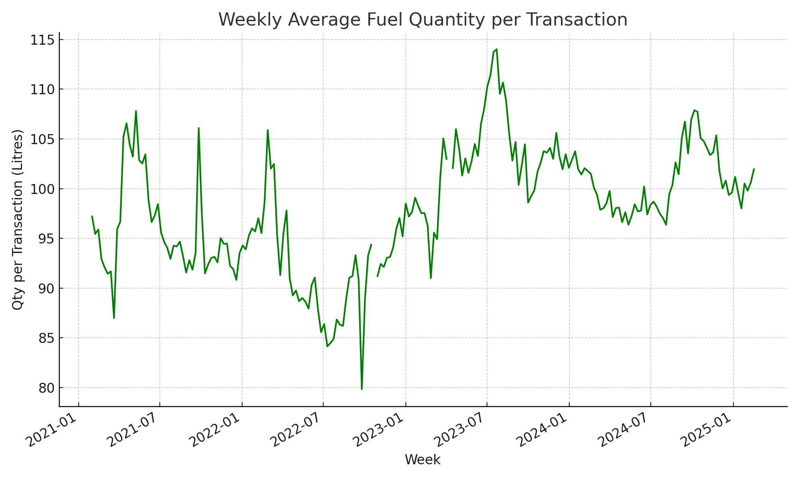

# Fuel Price Forecasting and Optimisation Project

This repository contains a comprehensive data analytics project developed for the **DAT7304 – Time Series Analysis and Forecasting** module in the MSc Business Analytics program. The project addresses real-world forecasting and optimisation problems in the UK fuel retail industry using time series models and linear programming.

## Project Overview

- **Duration:** January 2021 – April 2025  
- **Focus Area:** UK weekly average fuel prices  
- **Tools:** Python, Jupyter Notebook, PuLP, pandas, matplotlib, statsmodels  
- **Data Sources:**  
  - Internal fuel retail data (avg fuel price, transaction quantity, sales volume)  
  - External Brent crude oil prices  

The project is divided into two parts:

---

## Part A: Time Series Forecasting

This section answers five business questions using univariate and multivariate forecasting models:

### Key Questions:
1. What is the long-term trend in average weekly fuel prices in the UK?
2. Are there seasonal patterns in weekly fuel prices?
3. How does customer fuel demand respond to changes in fuel prices?
4. Can short-term forecasts help with better inventory and pricing decisions?
5. Does Brent crude oil price improve forecast accuracy?

### Models Used:
- ARIMA
- Holt-Winters
- SARIMAX (with Brent and demand as exogenous variables)
- VAR (multivariate)

### Evaluation Metrics:
- MAE (Mean Absolute Error)  
- RMSE (Root Mean Squared Error)  
- MAPE (Mean Absolute Percentage Error)

## Visualizations

### 1. Average Weekly Fuel Prices

### 2. Brent Crude Oil Prices

### 3. Quantity per Transaction

### 4. Seasonal Decomposition

### 5. ACF & PACF

**Conclusion:**  
SARIMAX and VAR models outperformed univariate models by integrating external variables like Brent prices and fuel demand, leading to more accurate and actionable forecasts.

---

## Part B: Linear Programming Optimisation

This section addresses an operational optimisation problem in fuel logistics.

### Objective:
Minimise total transportation costs while meeting customer demand and stock constraints.

### Features:
- LP model using PuLP in Python
- Decision variables for SKU-route combinations
- Constraints for demand fulfillment and stock availability
- Diagnostic reporting and cost visualisation strategy

**Outcome:**  
Although the model identified an infeasible solution (due to demand > stock), this provided valuable business insights and opportunities for inventory planning.

---

## Folder Structure

